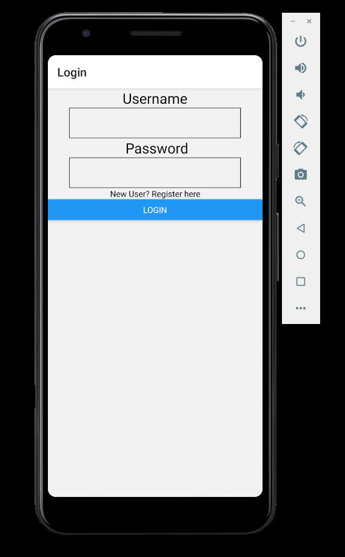

WeRamble App

How to use:

NOTE** IGNORE **3** AND **4** IF YOUR ONLY DOING FRONT END (I.E. NOT EDITING "server.js")

1. Install React Native (using CLI, not Expo) and get a basic helloworld app working. Im using android with the React Native CLI for testing but ios should work fine too. https://reactnative.dev/docs/environment-setup.
2. Once you've successfully got your helloworld app working 'clone this repo, open terminal in folder and run "npm install"
3. If you want to edit/test server.js, set "LOCAL" in utils.js to true and Change the value of "ip"s to your ipv4 address (this should begin with 192.168.1...).
4. Run "npm run server" to start the local server
5. Run "npm run android" or "npm run ios" to run the app in an emulator. If your phone is plugged into your computer with usb debugging enabled, it will open on your phone instead.
6. See todo.txt for jobs

